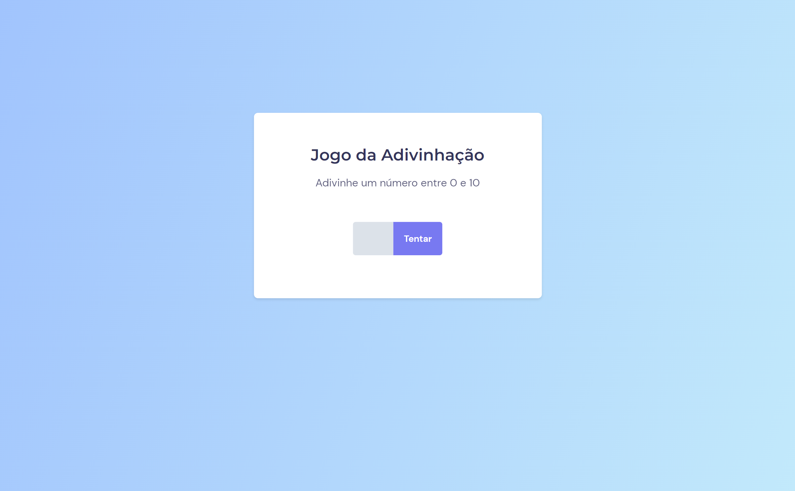

# Stage 5 - Jogo da Adivinhação

>Curso Explorer

Projeto construído no curso Explorer da Rocketseat.

[ 🔗 Clique aqui para acessar](https://ricardojcosta.github.io/explorer_stage5_Jogo/)

## ⚒ Tecnologias

  - HTML (html semântico)
  - CSS 
  - JS 
  - Git e Github

## ✉ Contato

ricardoredes2006@gmail.com